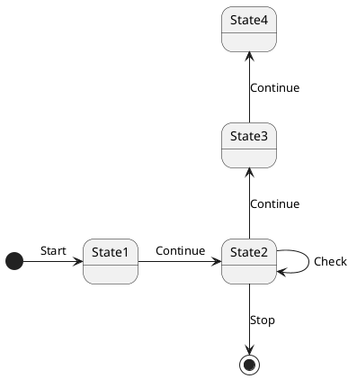
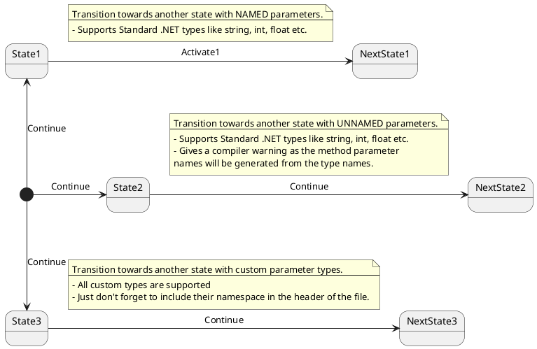
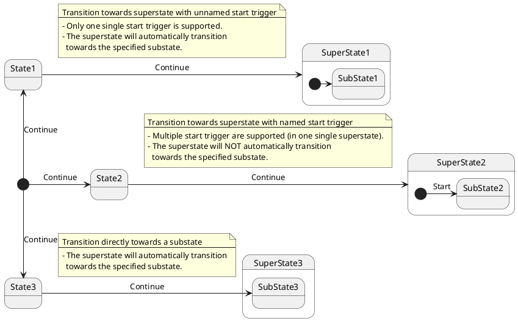

# PlantUML diagram to Stateless C# state machine code

## Features.
- On the fly code generation for Stateless using in-solution PlantUML diagrams.
- Generates correct async/sync methods+Stateless configuration - including fitting async OnEntry/OnExit (when possible).
- Generates methods+Stateless configuration (When configured in PlantUML).
- Roslyn warnings when the diagram contains constructions that Stateless cannot honor.
- Roslyn code fixes for when the transitions in the diagram are not implemented in the code base.

## How to start.
Usage:

1. Add the analyzer NuGet package to the target project:
   ```csproj
    <ItemGroup>
        <PackageReference Update="EtAlii.Generators.Stateless" Version="1.0.7" PrivateAssets="all" />
    </ItemGroup>
   ```

2. Also add the Stateless NuGet package to the target project:
   ```csproj
     <ItemGroup>
       <PackageReference Include="stateless" Version="5.10.1" />
     </ItemGroup>
   ```

3. Come up with a fancy PlantUML state machine diagram, for example:

    

4. Put the PlantUML diagram in a file, for example `SimpleStateMachine.puml` as specified below:
   ```puml
    @startuml
    'stateless namespace EtAlii.Generators.Stateless.Tests
    'stateless class SimpleStateMachineBase

    [*] -> State1 << async (string name) >> : Start
    State1 : this is a string
    State1 : this is another string
    State1 -> State2 << async >> : Continue
    State2 -down-> [*] : Stop
    State2 -> State2 << (string name) >> : Check
    State2 -up-> State3 << async >> : Continue
    State3 -up-> State4 : Continue
    @enduml
   ```
   Make sure to notice the stateless parameters added at the start of the file. They help the code generation process understand which class/namespace to generate.


5. Reference the file from the project (.csproj) as a `StatelessFile` entry:
   ```csproj
     <ItemGroup>
       <StatelessFile Include="MyFancyStateMachine.puml" />
     </ItemGroup>
   ```
6. Compile the project - Antlr is used to parse the puml file and instruct the Roslyn generator to create C# state machine code according to the states, triggers and transitions defined in the diagram.


7. Add a class file to implement the needed state machine behavior.
   ```cs
    namespace EtAlii.Generators.Stateless.Tests
    {
        using System.Collections.Generic;

        public class SimpleStateMachine : SimpleStateMachineBase
        {
            public List<string> Actions { get; } = new List<string>();

            protected override void OnState1Entered() => Actions.Add("State 1 entered");

            protected override void OnState1Exited() => Actions.Add("State 1 exited");
        }
    }
   ```
8. Create and trigger the state machine from somewhere in your code, for example as done in the Main method below.
   ```cs
    namespace EtAlii.Generators.Stateless.Tests
    {
        using System;

        public static class Program
        {
            public static void Main()
            {
                var stateMachine = new SimpleStateMachine();
                stateMachine.Start();
                Console.WriteLine(stateMachine.Actions[0]);
                stateMachine.Continue();
            }
        }
    }
   ```
9. Enjoy the magic that code-generation can bring to your project.


10. Star this project if you like it :-)

## Supported Stateless/PlantUML features.

<table width="100%">
    <thead>
        <td><b>Stateless</b></td>
        <td><b>PlantUML</b></td>
    </thead>
    <tr valign="top">
        <td>
        Supported: <br/>
        - State/Trigger enum creation<br/>
        - State machine instantiation<br/>
        - OnEntry/OnExit configuration and method mapping<br/>
        - Synchronous / Asynchronous transitions<br/>
        - Transition method parameterization<br/>
        Unsupported: <br/>
        - Guards <br/>
        </td>
        <td>
        Supported: <br/>
        - Named states<br/>
        - Named triggers/transitions<br/>
        - Internal transitions<br/>
        - Composite/nested/sub states<br/>
        - Notes + titles<br/>
        - Begin/End<br/>
        Unsupported: <br/>
        - Fork<br/>
        - History<br/>
        - Concurrent state<br/>
        - Conditional/choice<br/>
        </td>
    </tr>
</table>

## Advanced features.

### Synchronous / Asynchronous transitions.

The code generation can be configured to create asynchronous methods by providing stereotype details on the needed transitions. The below diagram and corresponding puml code show how to do so:



Please take notice:
- The `OnEntry` method will also be made asynchronous when all _inbound_ transitions are tagged as being asynchronous.
- The `OnExit` method will also be made asynchronous when all _outbound_ transitions are tagged as being asynchronous.
- When triggers are to be used in both synchronous and asynchronous two different methods will be generated: One for synchronous invocation and one for asynchronous invocation.
  It is up to the developer to call the right one.
- When a transition is configured as asynchronous, both the trigger methods and virtual methods will contain the "Async" postfix.

### Transition method parameterization.

Using stereotype details, transition can be configured in the puml file to demand parameters.
When parameter details are provided, the code generation writes both the trigger methods and virtual methods will the parameters specified.



Please take notice:
- When no parameter names are given the code generation tries to come up with a fitting set. Don't use this and use only fully qualified parameter names as the generated names will only cause confusion.
- When parameters are specified as custom types don't forget to add the `stateless using` statement to make the code generation aware of the namespace the custom types live in.

### Nested states.

Both Stateless and PlantUML support nested states. The code generator is able to parse and generate nesting but as this is a relative new feature there might be some hiccups. Happy to see PR's to improve these matters.



Please take notice:
- Currently states and substates cannot have the same name. In other word: each state name can only be used once in the state machine.
- The supported transitions are:
  1. Transition towards superstate with unnamed start trigger.
      - Only one single start trigger is supported.
      - The superstate will automatically transition towards the specified substate.
  2. Transition directly towards a substate.
      - The superstate will automatically transition towards the specified substate.
  3. Transition towards superstate with named start trigger.
      - Multiple start trigger are supported (in one single superstate).
      - The superstate will NOT automatically transition towards the specified substate.
